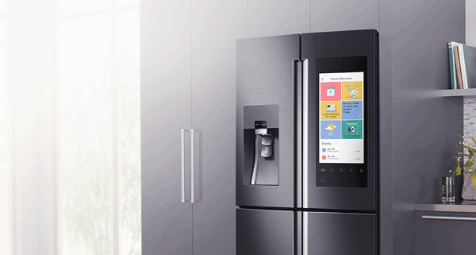

# Exercice de construction logique

## Objectifs pédagogiques
- mettre le pied à l'étrier de la programmation logique auprès des

## Préparatifs
- Réunir les juniors ayant des difficultés à concevoir des logiques de résolutions de problèmes
- Un grand local avec du papier
- prévoir 1 à 2 jours

## Dispositif pédagogique

Le coach se tient devant un tableau blanc.  
Avoir un frigo dans la pièce, avec différents objets à l'intérieur : 

- Bouteilles d'eau, dont une entamée
- boite d'oeufs (incomplète)
- un vieux sandwhich
- ...

Les juniors assis à proximité, disposent d'une table, avec papier brouillon et bic pour réfléchir.

### Intro
Le coach demande : 

- Représente ces infos en pseudo-JS  (Le coach divise le tableau blanc en 2 colonnes : dans une colonne l'inventaire concret, l'autre pour les code reviews
- constatation: ans avoir la finalité, c'est difficile. Ayons une finalité : - Le coach donne la liste des requirements (voir ci-dessous)

### Déroulement :

1. Le coach aide le groupe à résoudre le premier problème par des questions.  
2. Une fois qu'il sent que c'est lancé dans leur tête, il leur laisse 5-10 minutes pour terminer le premier problème. (pas laisser trop de temps, 10 minutes max ou dès que cela commence à bavarder)
3. Lorsqu'il y en a un qui pense avoir terminé, il explique au tableau ce qu'il a conçu.  
4. Si un autre a fait autrement, l'inviter à montrer (importance de voir qu'il y a plusieurs moyens de résoudre un problème).

## Situation-problème à exposer : le frigo

  

Toi et tes amies voulez lancer sur le marché un frigo "intelligent". Il est fabriqué, reste à le programmer.

**Explique comment tu résoudrais les problèmes suivants. A chaque fois, décris comment tu stockes les données et ensuite fournis du pseudocode répondant au problème.**

1. Afficher tout ce qu'il y a dans le frigo
1. Afficher une liste des courses pour remplacer ce qui a été entamé
2. Afficher la réponse à une question du type : "combien d'oeufs reste-t-il?" 
1. Suggérer des recettes sur base de ce qui est disponible actuellement dans le frigo (tu as accès à un API externe, acceptant une liste d'ingrédients et retournant une ou plusieurs recettes utilisant ces ingrédients. L'API permet de spécifier s'il faut avoir tous les ingrédients ou si elle peut retourner des recettes impliquant de compléter ce qu'on a déjà).

## Situation-problème 2 à exposer : l'usine Spa
Un bac plein de bouteilles de Spa vides. Il manque 3 bouteilles.
Décris, sur base de ce bac, la suite d'instructions à implémenter pour que toutes les bouteilles du bac soient remplis à la fin du script.

- si le bac peut contenir 24 bouteilles
- si tu ne sais pas combien de bouteilles peut contenir le bac.

--